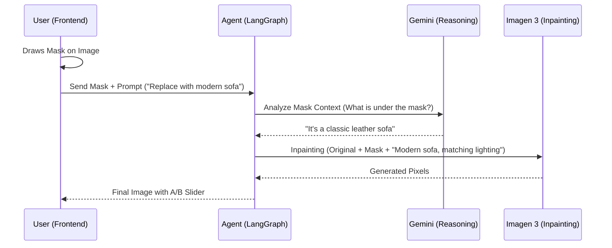

# Technical Specification: Magic Pencil (Targeted Inpainting)

## 1. Overview
The "Magic Pencil" is a high-precision modification tool that allows users to draw a mask over a specific area of an image and request a transformation only within that area. This maintains the global architectural context (walls, lighting, layout) while replacing or modifying specific elements (furniture, fixtures, textures).

## 2. Architecture (3-Tier Model)

### Tier 1: Directive (Intent & Strategy)
- **Agentic Triage**: The AI must first understand *what* is under the mask. 
- **Semantic Mapping**: Instead of just sending a prompt to the inpainting model, a reasoning step (Gemini 2.x) analyzes the mask + image to identify the object (e.g., "The user is highlighting a traditional chandelier").
- **Refined Prompting**: The generated prompt for the inpainting model is enriched with this context to ensure seamless integration.

### Tier 2: Orchestration (Frontend/Next.js)
- **Component**: `MaskCanvas.tsx`
    - Overlays a transparent canvas on the `SourceImage`.
    - Tools: Brush size, Eraser, Clear all.
- **Data Flow**:
    1. User draws on the image.
    2. Frontend generates a binary mask (Black = Preserve, White = Modify).
    3. Payload sent to backend: `{ source_image_url, mask_base64, user_prompt }`.
- **UI State**: The new render is displayed in an A/B slider overlaying the original.

### Tier 3: Execution (Backend/Python)
- **Model**: Vertex AI Imagen 3 (with Inpainting support).
- **Core Logic**: `src/tools/targeted_modification.py`
    - **Step 1**: Download source image.
    - **Step 2**: Contextual reasoning via Gemini Vision.
        - *Input*: Original Image + Red highlight on mask area.
        - *Output*: "The user wants to replace a [object] with [request]."
    - **Step 3**: Vertex AI Inpainting Call.
        - *Model*: `image-generation@006` (or latest Imagen 3).
        - *Parameters*: `base_image`, `mask_image`, `prompt`, `guidance_scale`.
    - **Step 4**: Upload result to Firebase and register in project.

## 3. Implementation Details

### Mask Protocol
- **Format**: PNG, 1-bit or 8-bit grayscale.
- **Alignment**: The mask must exactly match the dimensions of the `source_image_url` provided.
- **Transmission**: Base64 encoded in the tool call.

### Tool Schema: `targeted_modification`
```python
{
  "source_image_id": "string (URL or Firebase ID)",
  "mask_data": "string (base64 PNG)",
  "prompt": "string (User instructions)",
  "style": "string (Target design style)",
  "negative_prompt": "string (Optional constraints)"
}
```

## 4. Workflow Diagram


## 5. Security & Constraints
- **Validation**: Mask cannot be 100% white (that would be a standard I2I).
- **Quality**: Low-resolution masks will result in jagged edges; the frontend must ensure canvas-to-image scale parity.
- **Safety**: Standard AI safety filters for image generation apply.

## 6. Future Enhancements
- **Multi-Masking**: Selecting multiple disjoint areas.
- **Mask Color Selection**: Indicating different types of modifications with different colors (e.g., Red = Remove, Green = Change, Blue = Polish).
- **Undo/Redo**: Stroke-level history in the canvas component.
